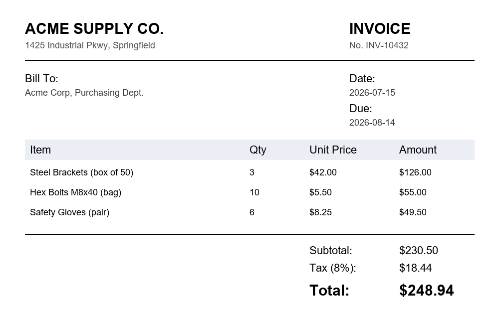

# 🔎 Unlimited-OCR Demo

A polished [Gradio](https://gradio.app) demo for
[**baidu/Unlimited-OCR**](https://huggingface.co/baidu/Unlimited-OCR) — one-shot,
long-horizon document parsing to Markdown, with layout grounding boxes. Deployed on
[Hugging Face Spaces](https://huggingface.co/spaces) with ZeroGPU.

[](https://huggingface.co/spaces/zestcommerce841428/unlimited-ocr-demo)
[](https://huggingface.co/baidu/Unlimited-OCR)
[](https://arxiv.org/abs/2606.23050)
[](LICENSE)

▶ **[Try it live](https://huggingface.co/spaces/zestcommerce841428/unlimited-ocr-demo)**

## Features

- **Single-image parsing** — upload a document page and parse it straight to Markdown
- **Two speed/accuracy modes** — *Gundam* (crops the page, fast) and *Base* (full page, most accurate)
- **Task presets** — document parsing, free OCR, figure parsing, and layout grounding, or write your own prompt
- **Layout grounding** — view detected regions drawn directly on the page
- **Multi-page PDF parsing** — one-shot parsing across the first few pages of a PDF via `model.infer_multi`
- **Streaming output** — tokens render into the UI as the model generates them
- **Example gallery** — try it instantly with two bundled synthetic sample documents

## Screenshot

<p align="center">
  
</p>

## Quickstart

Requires a CUDA GPU (the app loads the model in `bfloat16` and calls `.cuda()` at
startup — see [Running without a GPU](#running-without-a-gpu) if you don't have one).

```bash
git clone https://github.com/zestcommerce841428-png/unlimited-ocr-demo.git
cd unlimited-ocr-demo
pip install -r requirements.txt
python app.py
```

The app will be available at `http://127.0.0.1:7860`.

> **Note:** `transformers==4.57.1` is intentionally installed at runtime inside
> `app.py` rather than pinned in `requirements.txt` — see the comment at the top of
> the file for why (a real version conflict between what `transformers` and the
> Gradio SDK each require from `huggingface-hub`).

### Running without a GPU

The model requires CUDA. To develop the UI without a GPU, install the
[`spaces`](https://pypi.org/project/spaces/) package and deploy to a
[ZeroGPU Space](https://huggingface.co/docs/hub/spaces-zerogpu) instead — `@spaces.GPU`
lets the model load on a CPU-only machine and defers real execution to an
on-demand GPU worker. This is exactly how the [live demo](https://huggingface.co/spaces/zestcommerce841428/unlimited-ocr-demo) is deployed.

## Project structure

```
.
├── app.py            # Gradio app: UI, streaming inference, PDF handling
├── requirements.txt  # Build-time dependencies (transformers installed at runtime)
├── examples/          # Synthetic sample documents used by the example gallery
├── LICENSE
└── README.md
```

## How it works

- **Model loading** — `AutoModel.from_pretrained("baidu/Unlimited-OCR", trust_remote_code=True)`
  at module scope, per the [ZeroGPU pattern](https://huggingface.co/docs/hub/spaces-zerogpu):
  eager `.cuda()` load so weights are ready to stream into a GPU worker on first request.
- **Streaming** — Unlimited-OCR's `TextStreamer` prints generated tokens straight to
  `stdout` rather than exposing an iterator, so `app.py` runs inference in a background
  thread and taps `stdout` to stream partial output into the Gradio UI.
- **Single image** uses `model.infer(...)`; **multi-page PDF** uses `model.infer_multi(...)`
  after converting pages to images with PyMuPDF — both documented in the
  [model card](https://huggingface.co/baidu/Unlimited-OCR).

## Deploying your own copy

1. Create a new [Gradio Space](https://huggingface.co/new-space) (ZeroGPU hardware
   recommended — requires a PRO/Team/Enterprise plan, or request a free
   [community GPU grant](https://huggingface.co/docs/hub/spaces-zerogpu) on a non-PRO account).
2. Push this repo's files to it:
   ```bash
   hf upload <your-username>/<space-name> . --repo-type space
   ```
3. Add Spaces config frontmatter to the top of `README.md` in that Space
   (`sdk: gradio`, `app_file: app.py`, etc. — see the
   [Spaces config reference](https://huggingface.co/docs/hub/spaces-config-reference)).

## Credits

- Model: [baidu/Unlimited-OCR](https://huggingface.co/baidu/Unlimited-OCR) by Baidu,
  [paper](https://arxiv.org/abs/2606.23050), [GitHub](https://github.com/baidu/Unlimited-OCR) — MIT licensed
- Demo app: built with [Gradio](https://gradio.app) on [Hugging Face Spaces](https://huggingface.co/spaces)

## License

This demo's code is released under the [MIT License](LICENSE). The
Unlimited-OCR model itself is separately MIT licensed by Baidu — see its
[model card](https://huggingface.co/baidu/Unlimited-OCR) for details.
